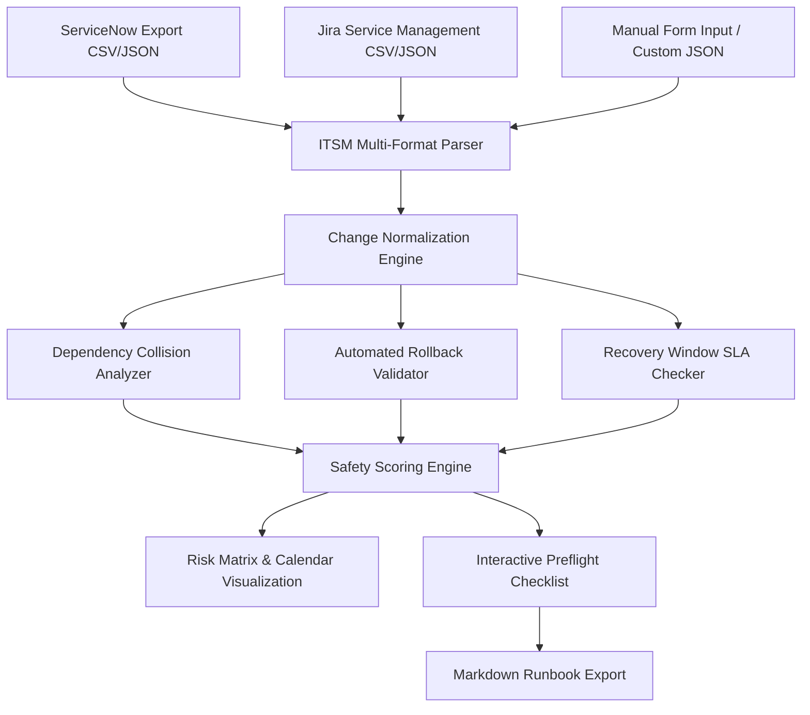

# Change Impact Studio

[](https://github.com/drummer475-94/change-impact-studio)
[](https://github.com/drummer475-94/change-impact-studio)
[](https://github.com/drummer475-94/change-impact-studio)
[](LICENSE)
[](package.json)

**[Launch the live app](https://drummer475-94.github.io/change-impact-studio/)**

**Change Impact Studio** is an enterprise-grade IT change management and risk analysis workbench designed for NOC/SOC operators, change coordinators, and sysadmins. It ingests change requests from ServiceNow and Jira Service Management (CSV/JSON), detects schedule collisions, performs recovery window SLA validation, and computes automated safety scores with executable runbook exports.

---

## ⚡ 60-Second Quick Review Guide

- **What it does**: Ingests ITSM change requests (ServiceNow CSV/JSON, Jira Service Management CSV/JSON), performs dependency conflict detection, computes rollback feasibility and recovery window SLA compliance, and generates human-readable runbooks with preflight checklists.
- **Key Features**:
  1. **Multi-Format ITSM Import**: Native parsers for ServiceNow (`sys_change_request` CSV/JSON) and Jira Service Management exports.
  2. **Automated Rollback Validation Workflow**: Validates procedure completeness, window duration feasibility, and preflight backup verification.
  3. **Recovery Window SLA Checks**: Enforces minimum lead time (24h), maximum window duration (8h), recovery buffer margins, and blackout window protection.
  4. **Safety Scoring Engine**: Generates 0-100 safety scores and A-F grades for individual changes and whole change plans.
- **Quick Run**:
  ```bash
  # Run unit test suite (97%+ coverage)
  node --test tests/*.test.js

  # Run test suite with coverage report
  node --test --experimental-test-coverage tests/*.test.js
  ```

---

## Architecture & Data Flow



---

## Technical Specifications & Features

### 1. Multi-Format ITSM Import Engine
- **ServiceNow Integration**: Parses CSV and JSON exports from `sys_change_request` table. Automatic field mapping for `number`/`sys_id`, `short_description`, `cmdb_ci`, `work_start`/`work_end`, `backout_plan`, and `test_plan`.
- **Jira Service Management Integration**: Native support for Jira CSV and JSON exports mapping `Key`, `Summary`, `Component/s`, `Custom field (Change start date)`, `Custom field (Rollback plan)`, and `Custom field (Test plan)`.
- **Robust CSV Parser**: Pure JS CSV parser handling quoted strings, escaped quotes, multiline values, and comma delimiter boundaries with zero external dependencies.

### 2. Rollback Validation Workflow
- Evaluates backout procedure clarity and completeness.
- Verifies estimated rollback duration against booked change window.
- Checks preflight backup and snapshot verification status.
- Generates `APPROVED`, `WARNING`, or `REJECTED` rollback status with actionable remediation steps.

### 3. Recovery Window SLA & Blackout Engine
- Enforces 24-hour minimum lead time for non-emergency changes.
- Caps maximum standard implementation windows at 8 hours.
- Verifies post-rollback recovery buffer margins (minimum 15 minutes).
- Flags changes scheduled during Friday evening (post 17:00) or weekend blackout windows.

### 4. Safety Scoring & Grading Engine
- Computes comprehensive 0-100 safety score and A-F grade per change and portfolio plan.
- Combines inherent risk matrix (likelihood x impact), rollback workflow readiness, SLA compliance flags, and active schedule collisions.

---

## Verification & Testing

```bash
# Run test suite
node --test tests/*.test.js
```

### Test Coverage Summary
- **Line Coverage**: `97.7%`
- **Function Coverage**: `97.8%`
- **Total Test Cases**: 16 unit and integration tests passing.

## License

Released under the [MIT License](LICENSE).
